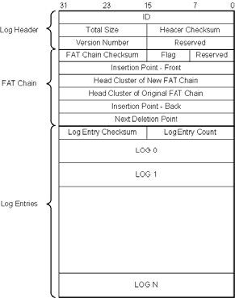
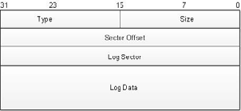

# Chapter 6 - FileX fault tolerant module

This chapter contains a description of the FileX Fault Tolerant Module that is designed to maintain file system integrity if the media loses power or is ejected in the middle of a file write operation.

## FileX Fault Tolerant Module Overview

When an application writes data into a file, FileX updates both data clusters and system information. These updates must be completed as an atomic operation to keep information in the file system coherent. For example, when appending data to a file, FileX needs to find an available cluster in the media, update the FAT chain, update the length filed in the directory entry, and possibly update the starting cluster number in the directory entry. Either a power failure or media ejection can interrupt the sequence of updates, which will leave the file system in an inconsistent state. If the inconsistent state is not corrected, the data being updated can be lost, and because of damage to the system information, subsequent file system operation may damage other files or directories on the media.

The FileX Fault Tolerant Module works by journaling steps required to update a file *before* these steps are applied to the file system. If the file update is successful, these log entries are removed. However, if the file update is interrupted, the log entries are stored on the media. Next time the media is mounted, FileX detects these log entries from the previous (unfinished) write operation. In such cases, FileX can recover from a failure by either rolling back the changes already made to the file system, or by reapplying the required changes to complete the previous operation. In this way, the FileX Fault Tolerant Module maintains file system integrity if the media loses power during an update operation.

> **Important:** *The FileX Fault Tolerant Module is not designed to prevent file system corruption caused by physical media corruption with valid data in it.*

> **Important:** *After the FileX Fault Tolerant module protects a media, the media must not be mounted by anything other than FileX with Fault Tolerant enabled. Doing so can cause the log entries in the file system to be inconsistent with system information on the media. If the FileX Fault Tolerant module attempts to process log entries after the media is updated by another file system, the recovery procedure may fail, leaving the entire file system in an unpredictable state.*

## Use of the Fault Tolerant Module

The FileX Fault Tolerant feature is available to all FAT file systems supported by FileX, including FAT12, FAT16, and FAT32. To enable the fault tolerant feature, FileX must be built with the symbol **FX_ENABLE_FAULT_TOLERANT** defined. At run time, application starts fault tolerant service by calling ***fx_fault_tolerant_enable*** immediately after the call to ***fx_media_open***. After fault tolerant is enabled, all file write operations to the designated media are protected. By default the fault tolerant module is not enabled.

> **Important:** *Application needs to make sure the file system is not being accessed prior to ***fx_fault_tolerant_enable*** being called. If application writes data to the file system prior to fault tolerant enable, the write operation could corrupt the media if prior write operations were not completed, and the file system was not restored using fault tolerant log entries.*

## FileX Fault Tolerant Module Log

The FileX fault tolerant log takes up one logical cluster in flash. The index to the starting cluster number of that cluster is recorded in the boot sector of the media, with an offset specified by the symbol **FX_FAULT_TOLERANT_BOOT_INDEX**. By default this symbol is defined to be 116. This location is chosen because it is marked as reserved in FAT12/16/32 specification.

Figure 5, "Log Structure Layout," shows the general layout of the log structure. The log structure contains three sections: Log Header, FAT Chain, and Log Entries.

> **Important:** *All multi-byte values stored in the log entries are in Little Endian format.*

**Figure 5. Log Structure Layout**

The Log Header area contains information that describes the entire log structure and explains each field in detail.

**TABLE 8. Log Header Area**

|Field|Size(in bytes)|Description|
|-----|--------------|-----------|
|ID|4|Identifies a FileX Fault Tolerant Log structure. The log structure is considered invalid if the ID value is not 0x46544C52.|
|Total Size|2|Indicates the total size (in bytes) of the entire log structure.|
|Header Checksum|2|Checksum that converts the log header area. The log structure is considered invalid if the header fields fail the checksum verification.|
|Version Number|2|FileX Fault Tolerant major and minor version numbers.|
|Reserved|2|For future expansion.|

The Log Header area is followed by the FAT Chain Log area. Figure 9 contains information that describes how the FAT chain should be modified. This log area contains information on the clusters being allocated to a file, the clusters being removed from a file, and where the insertion/deletion should be and describes each field in the FAT Chain Log area.

**TABLE 9. FAT Chain Log Area**

|Field|Size(in bytes)|Description|
|-----|--------------|-----------|
|FAT Chain Log Checksum|2|Checksum of the entire FAT Chain Log area. The FAT Chain Log area is considered invalid if the it fails the checksum verification.|
|Flag|1|Valid flag values are: 0x01 FAT Chain Valid 0x02 BITMAP is being used|
|Reserved|1|Reserved for future use|
|Insertion Point – Front|4|The cluster (that belongs to the original FAT chain) where the newly created chain is going to be attached to.|
|Head Cluster of New FAT Chain|4|The first cluster of the newly created FAT Chain|
|Head Cluster of Original FAT Chain|4|The first cluster of the portion of the original FAT Chain that is to be removed.|
|Insertion Point – Back|4|The original cluster where the newly created FAT chain joins at.|
|Next Deletion Point|4|This field assists the FAT chain cleanup procedure.|

The Log Entries Area contains log entries that describe the changes needed to recover from a failure. There are three types of log entry supported in the FileX fault tolerant module: FAT Log Entry; Directory Log Entry; and Bitmap Log Entry.

The following three figures and three tables describe these log entries in detail.

**Figure 6. FAT Log Entry**

**TABLE 10. FAT Log Entry**

|Field|Size(in bytes)|Description|
|-----|--------------|-----------|
Type|2|Type of Entry, must be FX_FAULT_TOLERANT_FAT_LOG_TYPE|
|Size|2|Size of this entry|
|Cluster Number|4|Cluster number|
|Value|4|Value to be written into the FAT entry|

**Figure 7. Directory Log Entry**

**TABLE 11. Directory Log Entry**

|Field|Size(in bytes)|Description|
|-----|--------------|-----------|
|Type|2|Type of Entry, must be FX_FAULT_TOLERANT_DIRECTORY_LOG_TYPE|
|Size|2|Size of this entry|
|Sector Offset|4|Offset (in bytes) into the sector where this directory is located.|
|Log Sector|4|The sector where the directory entry is located|
|Log Data|Variable|Content of the directory entry|

**Figure 8. Bitmap Log Entry**

**TABLE 12. Bitmap Log Entry**

|Field|Size(in bytes)|Description|
|-----|--------------|-----------|
|Type|2|Type of Entry, must be FX_FAULT_TOLERANT_BITMAP_LOG_TYPE|
|Size|2|Size of this entry|
|Cluster Number|4|Cluster number|
|Value|4|Value to be written into the FAT entry|

## Fault Tolerant Protection

After the FileX Fault Tolerant Module starts, it first searches for an existing fault tolerant log file in the media. If a valid log file cannot be found, FileX considers the media unprotected. In this case FileX will create a fault tolerant log file on the media.

> **Important:** *FileX is not able to protect a file system if it was corrupted before the FileX Fault Tolerant Module starts.*

If a fault tolerant log file is located, FileX checks for existing log entries. A log file with no log entry indicates prior file operation was successful, and all log entries were removed. In this case the application can start using the file system with fault tolerant protection.

However if log entries are located, FileX needs to either complete the prior file operation, or revert the changes already applied to the file system, effectively undo the changes. In either case, after the log entries are applied to the file system, the file system is restored into a coherent state, and application can start using the file system again.

For media protected by FileX, during file update operation, the data portion is written directly to the media. As FileX writes data, it also records any changes needed to be applied to directory entries, FAT table. This information is recorded in the file tolerant log entries. This approach guarantees that updates to the file system occur after the data is written to the media. If the media is ejected during the data-write phase, crucial file system information has not been changed yet. Therefore the file system is not affected by the interruption.

After all the data is successfully written to the media, FileX then follows information in the log entries to applies the changes to system information, one entry at a time. After all the system information is committed to the media, the log entries are removed from the fault tolerant log. At this point, FileX completes the file update operation.

During file update operation, files are not updated in place. The fault tolerant module allocates a sector for the data to write the new data into, and then remove the sector that contains the data to be overwritten, updating related FAT entries to link the new sector into the chian. For situations in which partial data in a cluster needs to be modified, FileX always allocates new clusters, writes the entire data from the old clusters with updated data into the new clusters, then frees up the old clusters. This guarantees that if the file update is interrupted, the original file is intact. The application needs to be aware that under FileX fault tolerant protection, updating data in a file requires the media to have enough free space to hold new data before sectors with old data can be released. If the media doesn't have enough space to hold new data, the update operation fails.
