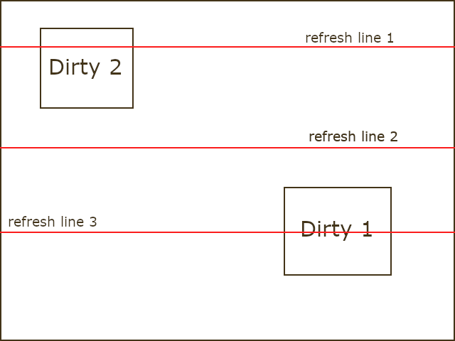
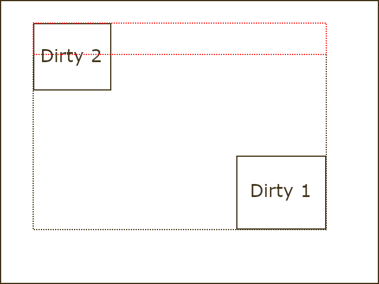
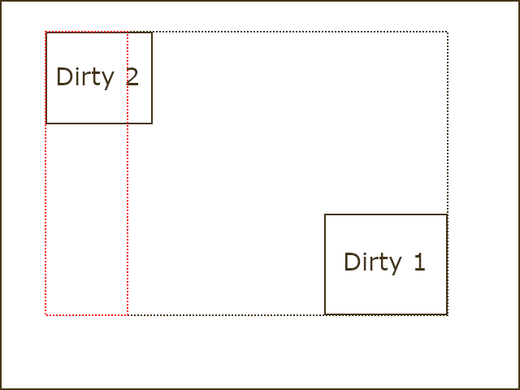

# Appendix J - Canvas Partial Frame Buffer Feature

The canvas partial frame buffer feature allows you to allocate a smaller portion of memory for the canvas buffer compared to the full canvas size. This is particularly advantageous for embedded systems with limited memory. This feature is disabled by default and only available for 565rgb color format without screen rotation. To enable this feature, you must define the configuration GX_ENABLE_CANVAS_PARTIAL_FRAME_BUFFER.

The minimum canvas memory size should be sufficient to accommodate a single line of pixels on the screen.

### Example to enable the canvas partial frame buffer feature

- Define the configuration GX_ENABLE_CANVAS_PARTIAL_FRAME_BUFFER.
- Uncheck "allocate canvas memory" in project configure dialog for your GUIX Studio project and generate output files.
- Call `gx_canvas_memory_define` to allocate canvas memory.
- Update your toggle function. The following example shows how to update the toggle function for the canvas partial frame buffer feature.
```
void hardware_16bpp_buffer_toggle(GX_CANVAS *canvas, GX_RECTANGLE *dirty)
{

GX_RECTANGLE    Limit;
GX_RECTANGLE    Copy;
INT             y;
USHORT*         pixel;


    USHORT *memptr = (USHORT*)canvas -> gx_canvas_memory;

    gx_utility_rectangle_define(&Limit, 0, 0,
                                BOARD_SCREEN_WIDTH - 1, BOARD_SCREEN_HEIGHT - 1);

    if (gx_utility_rectangle_overlap_detect(&Limit, &canvas->gx_canvas_dirty_area, &Copy))
    {
        for(y = Copy.gx_rectangle_top;  y <= Copy.gx_rectangle_bottom; y++)
        {
            pixel = memptr;
       
#if defined(GX_ENABLE_CANVAS_PARTIAL_FRAME_BUFFER)
            pixel += (y - canvas->gx_canvas_memory_offset_y) * canvas->gx_canvas_memory_width;
            pixel += (Copy.gx_rectangle_left - canvas->gx_canvas_memory_offset_x);
#else
            pixel += y * BOARD_SCREEN_WIDTH;
            pixel += Copy.gx_rectangle_left;
#endif
            
            BSP_LCD_DrawRGBImage(Copy.gx_rectangle_left, y, Copy.gx_rectangle_right - Copy.gx_rectangle_left + 1, 1, (uint8_t *)pixel);
        }
    }
}
```

### Canvas Refresh Methods for Partial Frame Buffer Feature

GUIX manages the canvas dirty area using a linked list. By default, the canvas refreshes its dirty areas by iterating through the dirty list and refreshing each dirty area sequentially. This approach optimizes the utilization of available canvas memory. However, this method does not guarantee a specific refresh direction, which can make it challenging to effectively mitigate potential tearing effects.



*Figure 1: Tearing Effect Example.*

Let's consider Figure 1 as an example to illustrate how tearing effect happens. In this scenario, the canvas exhibits two dirty areas labeled as "Dirty 1" and "Dirty 2." The red horizontal line represents the display refreshing line.

The canvas undertakes the task of refreshing the dirty areas in the sequence of "Dirty 1" followed by "Dirty 2." Assuming the display refreshes from top to bottom, the process unfolds as follows: When the display refreshes line 1, the canvas initiates the refreshing of its dirty area. By the time the display refresh reaches line 2, "Dirty 1" has been updated. When the display refresh advances to line 3, "Dirty 2" is updated as well.

However, upon reaching the bottom, only the updated portion of "Dirty 1" is displayed on the screen, while the updated portion of "Dirty 2" is yet to be displayed. This disparity between the two areas may cause the undesirable tearing effect.

To address the previously mentioned issues, two additional canvas refresh methods are made available. You can enable one of these methods using either of the following two definitions:
- GX_CANVAS_REFRESH_DIRECTION_VERTICAL
- GX_CANVAS_REFRESH_DIRECTION_HORIZONTAL

#### Canvas Refresh Direction: Vertical

When the canvas refresh direction is set to vertical, the canvas refreshes its dirty areas in the vertical direction.



*Figure 2: Canvas Refreshing with Direction Set to Vertical.*

Figure 2 illustrates the canvas refreshing process with the direction set to vertical. In this configuration, a combined dirty area is calculated, encompassing both "Dirty 1" and "Dirty 2," represented by the dashed black rectangle. A mask window is employed, matching the width of the combined dirty area, with the total mask size matching the available canvas size. This mask window is moved vertically from the top to the bottom within the combined dirty area, updating the dirty area located within the mask window.

There can still be tearing effect in this refreshing method. To eliminate the tearing effect, additional work is necessary. For example, if the display refreshing speed is faster than the canvas refreshing speed, while the display refreshing pass the top of the combined refreshing area, the canvas can start refreshing, but the display won't show the updated content until the next refreshing pass. This can eliminate the possible tearing effect.

### Canvas Refresh Direction: Horizontal

When the canvas refresh direction is set to horizontal, the canvas refreshes its dirty areas in the horizontal direction.



*Figure 3: Canvas Refreshing with Direction Set to Horizontal.*

Figure 3 illustrates the canvas refreshing process with the direction set to horizontal. In this configuration, a combined dirty area is calculated, encompassing both "Dirty 1" and "Dirty 2," represented by the dashed black rectangle. A mask window is employed, matching the height of the combined dirty area, with the total mask size matching the available canvas size. This mask window is moved horizontally from the left to the right within the combined dirty area, updating the dirty area located within the mask window.

There can still be tearing effect in this refreshing method. To eliminate the tearing effect, additional work is required. For example, if the display refreshing speed is faster than the canvas refreshing speed, while the display refreshing pass the left of the combined refreshing area, the canvas can start refreshing, but the display won't show the updated content until the next refreshing pass. This eliminates the tearing effect.