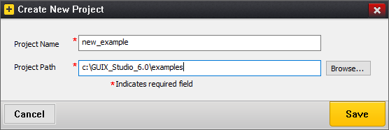
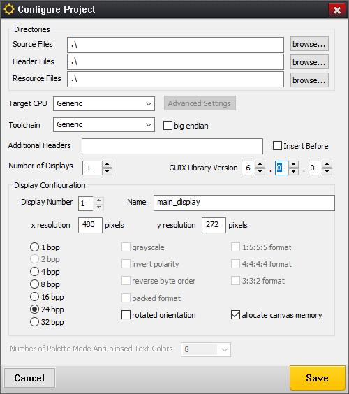
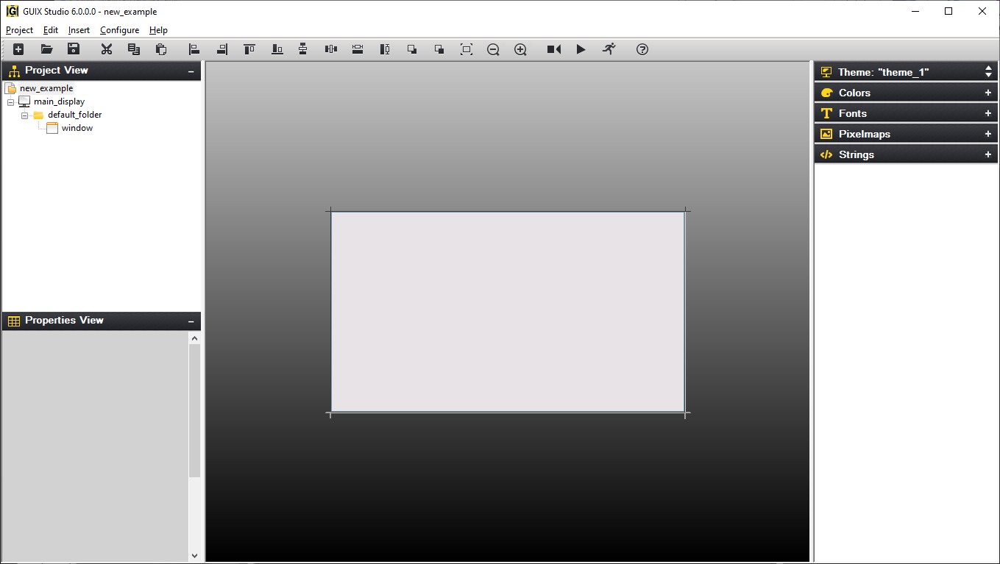
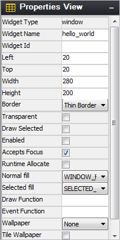
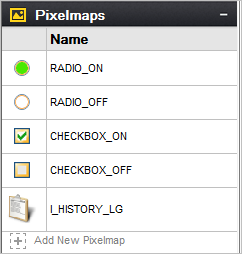
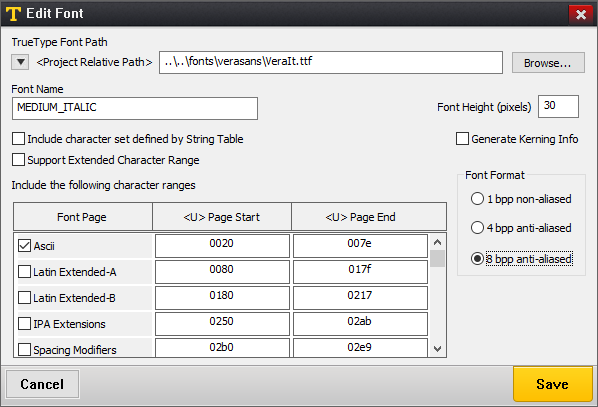
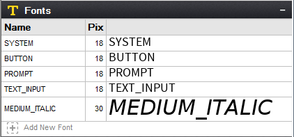
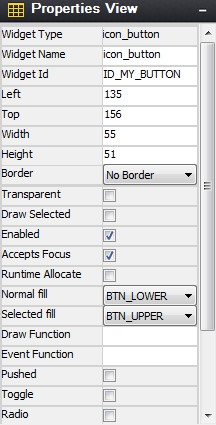
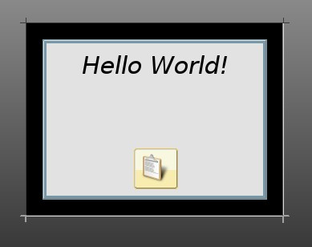

# Chapter 10: Example Project

This chapter describes how to create an example project in GUIX Studio and execute the example on GUIX.

## Create New Project

The first step is creating a new project and configuring the displays and languages that the project will support. When you first start GUIX Studio, you will see the ***Recent Projects*** screen:


**Figure 10.1**

Click on the ***Create New Project***… button to begin a new project. You will be presented with the ***New GUIX Project*** dialog, shown here:



**Figure 10.2**

Type the name "***new_example***" as the project name. Project names should use standard C variable naming rules, that is, no special or reserved characters. Type the path to the location where the project should be saved. The path must be a valid file system directory, that is, GUIX Studio will not create the directory if it does not exist. Click "OK" to create the project.

The next screen shown is the Project Configuration screen, shown here:



**Figure 10.3**

This dialog allows you to specify how many displays your project will support, and give a name to each display. You must specify the color format supported by each display, and optionally type a pathname for the output files generated by Studio for each display. The default directory for the output files is "***.\\***", meaning the C output files are written to the same directory as the project itself.

For this example, leave the ***Number of Displays*** set to "1", type the name "***main_display***" in the display name field, and check "***allocate canvas memory***". Leave the resolution, color format, and directory fields at their default values, and click ***OK***.

You should now see your project open with the Studio IDE, as shown in figure 10.4:



**Figure 10.4**

When you create a new project, GUIX Studio automatically creates a default window as the starting point for your project. This gray box is the default window created for you, centered within the *Target View*.

If this window is not selected, click on the window so that the dashed selection box is drawn around the window. Now in the ***Properties View***, change the ***Widget Name***, ***Widget Id***, ***Left***, ***Top***, ***Width***, ***Height***, and ***Border*** to match those settings shown below. As you make these changes, you should see your changes immediately taking effect within the Target View.



**Figure 10.5**

Next we will add a pixelmap resource to be used within a ***GX_ICON*** widget. Several icons are provided with your GUIX Studio distribution that will work fine for this example. Expand your ***Pixelmaps*** Resource View and click the ***Add New Pixelmap*** button:


Browse to your GUIX Studio installation folder, and within the ***./graphics/icons*** folder select the file named ***i_history_lg.png***. Click ***Open*** to add this resource to your project. Your ***Pixelmaps*** Resource View should now show a preview of the newly added icon image:



**Figure 10.6**

We will use this new image resource later as part of our UI design.

Similar to adding a pixelmap resource, we will add a new font resource to our toolbox so that we can use this font later in our design. Expand the ***Fonts*** Resource View and click on the ***Add New Font*** button. This action will invoke the ***Add/Edit*** font dialog. Next, browse to the supplied GUIX fonts in the GUIX Studio installation folder, ***.\\fonts\\verasans***, and select the TrueType font file named ***VeraIt.ttf***. Type font the font name "***MEDIUM_ITALIC***" in the font name field, and type "***30***" in the height field. Your dialog should now look like this:



**Figure 10.7**

Click ***OK*** to add this font to your project. You should now see the font in your Resource View:



**Figure 10.8**

We will use this new font later in our UI design.

Now that we have some new resources available, we need to add some child widgets to our screen that can utilize these resources. Select the previously created window named "***hello_world***" by right-clicking on the window in the Target View. In the pop-up menu that is now displayed, select the menu command ***Insert, Text, Prompt*** to insert a new ***GX_PROMPT*** widget and attach the widget to the background window. Your window should now look like this:


**Figure 10.9**

Click on the font named "***MEDIUM_ITALIC***" in the ***Fonts*** Resource View, and drag and drop the font on the prompt widget. Next, edit the prompt properties as shown in figure 10.10 to resize the prompt, set the prompt transparency, and change the prompt text and style:


**Figure 10.10**

You may need to scroll vertically in the Properties View to see each of these settings depending on your screen resolution. After making these changes, your Target View should now look like this:


**Figure 10.11**

Next we will place an Icon Button style widget on the screen. Select the background window by clicking on it, and use either the top-level menu or the right-click pop-up menu to select ***Insert, Button, Icon Button*** to add a new ***GX_ICON_BUTTON*** to the window. Click on the Icon named ***I_HISTORY_LG*** that we added earlier and drag it to the icon button. Using the properties view, adjust the icon position and size as show below:



**Figure 10.12**

Your screen should now look like this:



**Figure 10.13**

We will call this complete for the simple example screen design. Your actual application screens will likely be much more sophisticated, but this is enough to show you how to use GUIX Studio to create your own application screens.

## Generate Resource and Application Code

The next step is to generate the resource file and specification file that define the embedded GUIX run-time UI. To generate your output files you will need right-click on the ***main_display*** node in the Project View, and select the ***Generate Resource Files*** command. You will observe an information window that indicates your resource files have been generated, as shown in figure 10.14:


**Figure 10.14**

Click ***OK*** to dismiss this notification, and use the same procedure to right-click on the ***main_display*** node and select the ***Generate Specification Files*** command. You should observe a similar notification window. You have now generated your simple UI application files.

## Create User Supplied Code

The next step is to create your own application file that will invoke the GUIX Studio-generated screen design. Using your preferred editor, create a source file named ***new_example.c***, and enter the following source code into this file:

```C

/* This is an example of the GUIX graphics framework in Win32. */
/* Include system files. */

#include <stdio.h>
#include "tx_api.h"
#include "gx_api.h"

/* Include GUIX resource and specification files for example. */

#include "new_example_resources.h"
#include "new_example_specifications.h"

/* Define the new example thread control block and stack. */

TX_THREAD new_example_thread;
UCHAR new_example_thread_stack[4096];

/* Define the root window pointer. */

GX_WINDOW_ROOT *root_window;

/* Define function prototypes. */

VOID new_example_thread_entry(ULONG thread_input);
UINT win32_graphics_driver_setup_24bpp(GX_DISPLAY *display);

int main()
{
    /* Enter the ThreadX kernel. */
    tx_kernel_enter();
    return(0);
}

VOID tx_application_define(void *first_unused_memory)
{
    /* Create the new example thread. */
    tx_thread_create(&new_example_thread, "GUIX New Example Thread", 
                      new_example_thread_entry, 0, 
                      new_example_thread_stack, sizeof(new_example_thread_stack),
                      1, 1, TX_NO_TIME_SLICE, TX_AUTO_START);
}

VOID new_example_thread_entry(ULONG thread_input)
{

    /* Initialize the GUIX library */
    gx_system_initialize();

    /* Configure the main display. */
    gx_studio_display_configure(MAIN_DISPLAY,                      /* Display to configure*/
                                win32_graphics_driver_setup_24bpp, /* Driver to use */
                                LANGUAGE_ENGLISH,                  /* Language to install */
                                MAIN_DISPLAY_DEFAULT_THEME,        /* Theme to install */
                                &root_window);                     /* Root window pointer */

    /* Create the screen - attached to root window. */

    gx_studio_named_widget_create("hello_world", (GX_WIDGET *) root_window, GX_NULL);

    /* Show the root window to make it visible. */
    gx_widget_show(root_window);

    /* Let GUIX run. */
    gx_system_start();

}
```

The source code above creates a typical ThreadX thread named `GUIX New Example Thread` with a stack size of 4K bytes. The interesting work begins in the function named ***new_example_thread_entry***. This function is where the GUIX specific thread begins to run.

The first call is to the function named ***gx_system_initialize***. This call is always required before any other GUIX APIs are invoked to prepare the GUIX library for first use.

Next, the example calls the function ***gx_studio_display_configure***. This function creates the GUIX display instance, installs the requested language of the application string table, installs the requested theme from the display resources, and returns a pointer to the root window that has been created for this display. The root window is used as the parent of all top-level screens that our application will display.

Next the example calls ***gx_studio_named_widget_create*** to create an instance of our ***hello_world*** screen. This function uses the data structures and resource produces by GUIX Studio to create an instance of the screen as we have defined it. We pass the root window pointer as the second parameter to this function call, meaning we want the screen to be immediately attached to the root window. The last parameter is an optional return pointer that can be used if we want to keep a pointer to the created screen.

Next ***gx_widget_show*** is called, which makes the root window and all of its children, including the ***hello_world*** screen, visible.

Finally, the example calls ***gx_system_start***. This function begins executing the GUIX system event processing loop.

## Build and Run the Example

Building and running the example is specific to your build tools and environment. However we can define the general process:

1. Create a new directory and application project
1. Add these files to the project:

    **new_example_resources.c**

    **new_example_specification.c**

    **new_example.c**

1. Add the Win32 run-time support files from the GUIX Studio installation path ***./win32_runtime***. This includes the ThreadX and GUIX Win32 header and run-time library files.
1. Add the GUIX Win32 library (***gx.lib***) to the project
1. Add the ThreadX Win32 library (***tx.lib***) to the project
1. Compile, Link, and Run the application!
