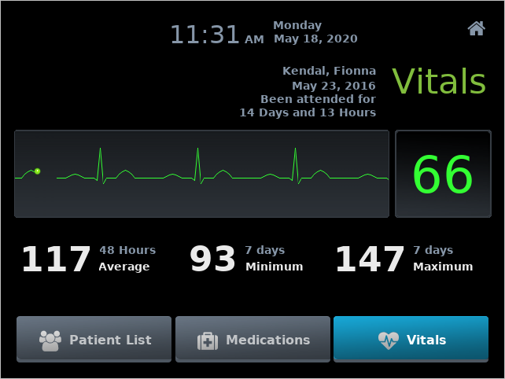
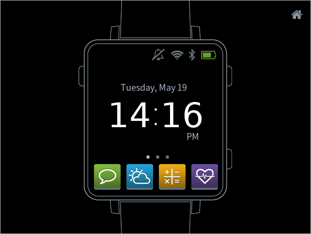
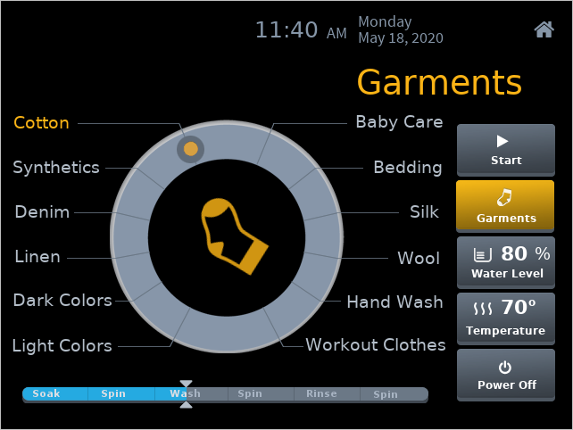
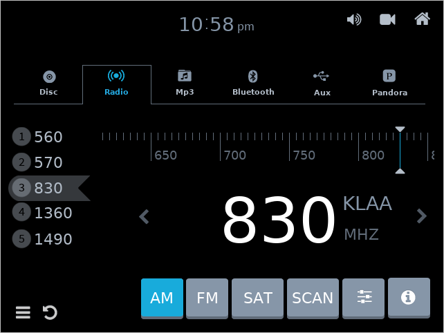
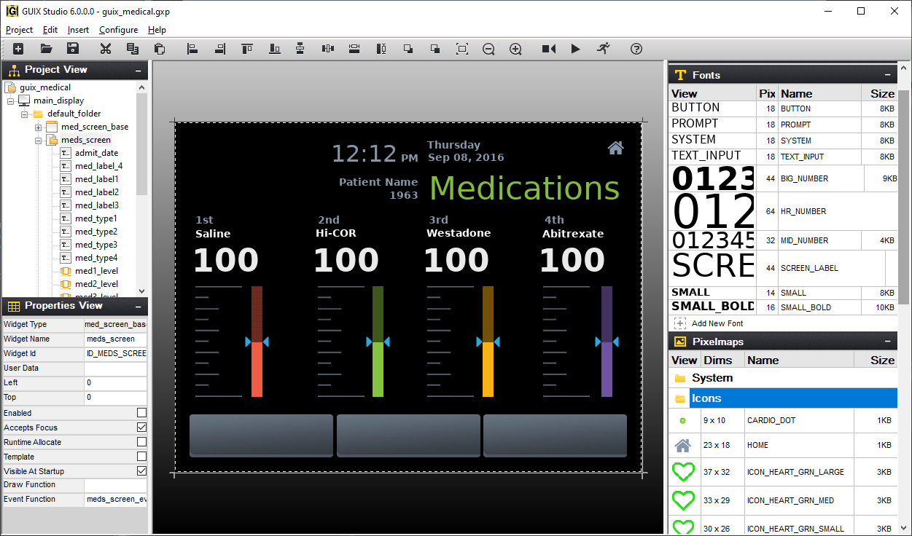

# Overview of GUIX and GUIX Studio

GUIX embedded GUI is Eclipse Foundation's advanced, industrial grade GUI solution designed specifically for deeply embedded, real-time, and IoT applications. Eclipse Foundation also provides a full-featured WYSIWYG desktop design tool named GUIX Studio, which allows developers to design their GUI on the desktop and generate GUIX embedded GUI code that can then be exported to the target. GUIX is fully integrated with ThreadX RTOS and is available for many of the same processors supported by ThreadX. All of this combined with an extremely small footprint, fast execution, and superior ease-of-use, make GUIX the ideal choice for the most demanding embedded IoT applications requiring a user interface. 

## GUIX API

### Powerful APIs

* Full support for direct canvas drawing when needed
* Simple to interact with GUIX Studio generated code
* APIs for line, rectangle, polygon, etc.
* APIs for circle, arc, pie, chord, ellipse, etc.
* APIs for text drawing and positioning
* Anti-aliasing, texture fills, and solid fills
* APIs for creating and modifying screens and widgets

### GUIX Studio Generated Files

* Automatically generated ANSI C source files
* Insulates application software from layout details
* Includes fonts and images required by UI design
* Generated files compiled with application code
* Screen layout can be updated without affecting application logic
* Resource IDs create language and theme independence
* User-supplied custom drawing and event processing functions

### Widget library

* Pre-defined but customizable set of common interface elements
* Extremely small, compact, and efficient
* Library includes button, gauge, list, window, scroll, slider, progress bar, prompt and many more
* Fully customizable drawing and appearance
* Fully customizable operation and event handling
* Only the widgets used are linked with application software

### Math and utilities

* Functions for sin, cos, arcsin, arccos, tangent, square root
* Functions for manipulating screen regions
* System configuration and startup
* Memory pool definition (optional)
* Timer Management
* Animation Management
* Dirty list maintenance

### Image processing

* Functions for runtime decode of jpeg and png images
* Apply dithering and color space conversion
* Image rotation
* Image scaling
* Image blending

### Event processing

* Automatically suspends GUIX thread when idle
* Event-driven programming model popular in UI design
* Insulates input drivers from GUIX drawing thread
* Functions for sending and receiving events
* Pre-defined event types for all GUIX widget types
* User-defined custom events supported

### Canvas processing

* Clipping and Z-Order maintenance
* Insulates widget library from hardware details
* Insulates application from hardware details
* Automatic background refresh of dirty areas
* Multiple canvases with layering and blending supported
* Can be invoked directly by the application software

### Input device driver(s)

* Hardware-specific support, GUIX and application insulated from hardware details
* Resistive Touch, Cap Touch, and keypad supported
* Input events passed to GUIX event queue

### Display drivers

* Hardware-specific support
* Generic drivers provided for all color depth and formats
* Customized to utilize available graphics accelerators

### Target hardware

* Nearly any hardware capable of graphical output Is compatible with GUIX
* Multiple physical displays supported
* Minimal RAM and Flash requirements

## Create Elegant User Interfaces

GUIX and GUIX Studio provide all the features necessary to create uniquely elegant user interfaces. The standard GUIX package includes various sample user interfaces, including a medical device reference, a smart watch reference, a home automation reference, an industrial control reference, an automotive reference, and various sprite and animation examples.

### Home Automation

### Medical

### Consumer

### White Goods

### Automotive

### Industrial

Each GUIX reference has a corresponding GUIX Studio project that defines all the graphical elements of the reference design. Changing a reference design is easy. Simply open the corresponding GUIX project, make the desired changes, save the project, and then select *Project*.

Generate All Output Files to generate the C code for GUIX. Then simply rebuild the target application and run to observe the modified reference design.

### GUIX Memory footprint

GUIX has a remarkably small minimal footprint of 13.2KB of FLASH and 4KB RAM for basic support, not including the memory required for a canvas.

For a display with internal GRAM and self-refresh technology, no canvas memory is required. However, to improve drawing performance, or for a display configuration that does not utilize GRAM local to the display, a canvas memory area is defined by the application.

Canvas memory requirements are a function of the canvas size as well as the color depth, and are defined by the formula:

<i>Canvas RAM (bytes) = (x * y * (bpp/8))</i>

Where "x" and "y" are the dimensions of the canvas (display).

Most applications also utilize graphical resources, which are not included in the core GUIX library storage requirements. These resources include fonts, graphical icons (pixelmaps), and static strings. This data can be stored in the const memory section (i.e. FLASH).

The size of this memory area is dependent on a number of factors, including the number and size of unique fonts used, the number and size of the graphical icons used, the output color format, and whether or not each resource is using compressed data, since GUIX supports RLE compression of both font and pixelmap data. The storage requirements for each resource are displayed within the GUIX Studio application, allowing the user to track and monitor the amount of flash memory that will be consumed by the application resources.

Like ThreadX, the size of GUIX automatically scales based on the services actually used by the application. This virtually eliminates the need for complicated configuration and build parameters, making things easier for the developer.

#### Simple, easy-to-use

GUIX is very simple to use and GUIX Studio makes it even easier by allowing developers to visually design on the desktop and generate C code that runs on the actual target. Applications can then add their own custom event handling and drawing functions to complete their GUI.

Using the GUIX API is straightforward. The GUIX API is both intuitive and highly functional. The API names are made of real words and not the "alphabet soup" and/or the highly abbreviated names that are so common in other file system products. All GUIX APIs have a leading *gx_* and follow a noun-verb naming convention. Furthermore, there is a functional consistency throughout the API. For example, all APIs that initialize a widget control block are named &lt; widget_type&gt;_create, and the create function parameters for each widget type are always defined in the same order.

### Comprehensive set of built-in widgets

* GUIX provides a rich set of built-in widgets, including:
* Accordion Menu
* Button
* Checkbox
* Circular Gauge
* Drop Down List
* Horizontal List
* Horizontal Scrollbar Window
* Icon
* Icon Button
* Line Chart
* Menu
* Multi Line Text Button
* Multi Line Text Input
* Multi Line Text View
* Numeric Pixelmap Prompt
* Numeric Prompt
* Numeric Scroll Wheel
* Pixelmap Button
* Pixelmap Prompt
* Pixelmap Slider
* Pixelmap Sprite
* Progress Bar
* Prompt
* Radial Progress Bar
* Radio Button
* Scroll Wheel
* Single Line Text Input
* Slider
* String Scroll Wheel
* Text Button
* Tree View
* Vertical List
* Vertical Scrollbar

It's easy for the application to create its own customer widgets as well.

### Complete low-level drawing API

GUIX provides a robust canvas drawing API, allowing the application to render complex graphical shapes.

All functions support anti-aliasing on high color depth targets, and all shapes can be filled our outlined, including solid and pixelmap pattern fills. All drawing primitives support brush alpha when running at 16 bpp and higher color depth. Drawing functions include:

* Arc Draw
* Circle Draw
* Line Draw
* Pie Draw
* Pixelmap Blend
* Pixelmap Tile
* Polygon Draw
* Text Draw
* Chord Draw
* Ellipse Draw
* Pixel Draw
* Pixelmap Draw
* Pixelmap Rotate
* Rectangle Draw
* Text Blend

### Default free fonts and easy to add more

GUIX provides a free set of TrueType fonts. Developers can add additional TrueType fonts as desired.

The GUIX font format supports 8bpp anti-aliasing, 4bpp anti-aliasing, and 1bpp monochrome fonts. For the most resource-constrained applications, GUIX pre-renders the TrueType fonts to a compressed bitmap format using our GUIX Studio desktop tool.

### Custom JPG and PNG decoder implementation

Custom JPG and PNG decoder implementation JPG and PNG file decoder implementation. This implementation supports color space conversion, dithering, and runtime creation of GUIX-compatible pixelmap format images.

### Extensive display and touchscreen support

GUIX provides generic display drivers for nearly all color formats, including 1bpp monochrome, 8 bpp palette, 8 bpp 3:3:2 format,

16 bpp 565 rgb format, 16 bpp 4:4:4:4 format, 32 bpp x:r:g:b format, and 32 bpp a:r:g:b format. In addition, GUIX is integrated with many of the most popular LCD controllers and hardware accelerators (ST ChromeArt, Renesas Synergy, etc.).

GUIX fully supports touchscreen (including gesture support), pen, and virtual keyboard input devices.

### GUIX Studio desktop WYSIWYG tool

GUIX Studio provides a complete WYSIWYG screen design environment which allows the user to drag-and-drop graphical elements used to build the GUI screens. GUIX Studio automatically generates C code compatible with the GUIX library, ready to be compiled and run on the target. Developers can produce pre-rendered fonts for use within an application using the integrated GUIX Studio font generation tool. Fonts can be generated in monochrome or anti-aliased formats, and are optimized to save space on the target. Fonts can include any set of characters, including Unicode characters for multi-lingual applications.

GUIX Studio facilitates the import of graphics from PNG or JPG files with conversion to compressed GUIX Pixelmaps for use on the target system. Many of the GUIX widget types are designed to incorporate user graphics for a custom look and feel. In addition, GUIX Studio allows customization of the default colors and drawing styles used by the GUIX widgets, allowing developers to tune the appearance of GUIX very easily. Generation and maintenance of application strings is another built-in facility of GUIX Studio. This enables developers to design an application using one language for developing, and quickly and easily add support for additional languages after the product is released. A complete GUIX application can be executed on a PC desktop within the GUIX Studio environment, allowing a quick and easy generation and demonstration of GUI concepts, testing of screen flows, and observation of screen transitions and animations. When completed, a design can be exported as target-ready C data structures, ready to be compiled and linked with the GUIX and ThreadX libraries.

GUIX and GUIX Studio support multiple resource themes, allowing an application to be easily reskinned at run-time. Fonts, colors, and pixelmaps can be changed at run-time with one simple API.

## Learn more about GUIX Studio

### Complete Win32 simulation

GUIX runs on a Windows PC, using exactly the same drawing library that runs on the target board. With GUIX, you can build and run a GUI application on the PC, and use the same application code on your target for debugging, rapid prototyping, demonstration, and WYSIWYG target operation.

### Advanced technology

GUIX's advanced technology incorporates:
* Alpha blending
* Anti-Aliasing
* Automatic scaling
* Bitmap compression
* Canvas blending
* Custom widget support
* Deferred drawing support
* Dithering support
* Endian neutral programming
* Hardware accelerator support
* Multilingual support and UTF-8 encoding
* Multiple display and canvas support
* Optimized clipping, drawing, and event handling
* Runtime JPEG and PNG decoder
* Skinning and Themes
* Supports monochrome through 32-bit true-color with alpha graphics formats
* Transitions, Sprites, and Animation support
* Win32 simulation
* Window management including Viewports and Z-order maintenance
