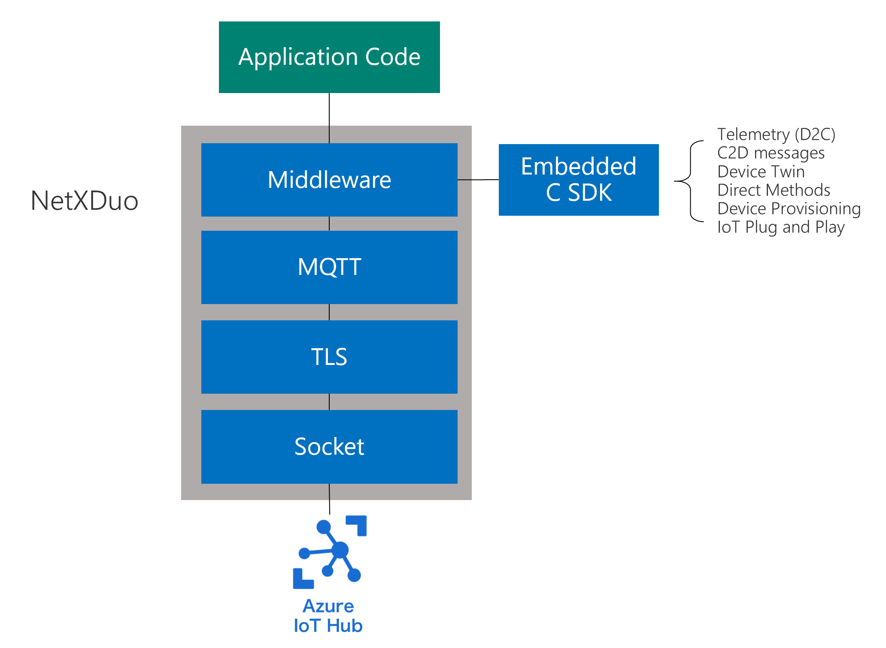

# Overview of NetX Duo

NetX Duo embedded TCP/IP network stack is Eclipse Foundation's advanced, industrial grade dual IPv4 and IPv6 TCP/IP network stack that is designed specifically for deeply embedded, real-time, and IoT applications. NetX Duo provides embedded applications with core network protocols such as IPv4, IPv6, TCP, and UDP as well as a complete suite of additional, higher-level add-on protocols. NetX Duo offers security via additional add-on security products, including NetX Duo Secure IPsec and NetX Duo Secure SSL/TLS/DTLS. All of this combined with a small footprint, fast execution, and superior ease-of-use make NetX Duo the ideal choice for the most demanding embedded IoT applications.

## API protocols

### MQTT

- Messaging Queue Telemetry Transport (MQTT)
- Minimal 2.7 KB FLASH

### Auto IP

- Automatic IPv4 address assignment
- Minimal 1.2 KB, 300 bytes of RAM

### HTTP, HTTPS

NetX Duo supports the following HTTP/HTTPS protocols.

#### HTTP 1.0

- Hypertext Transfer Protocol(HTTP)
- Minimal 2.8 KB to 4.8 KB FLASH / 0.4 KB to 1.0 KB RAM
- Client and server support

#### HTTP/HTTPS 1.1

- Hypertext Transfer Protocol(HTTP)
- Minimal 3.0 KB to 9.5 KB FLASH / 0.5 KB to 2 KB RAM
- Client and server support
- Multiple incoming client sessions
- Plain text and encrypted HTTPS
- Persistent connection support
- Multipart file upload
- Fully integrated with NetX Duo Secure TLS

### SMTP

- Simple Mall Transfer Protocol (SMTP)
- Minimal 4.1 KB and 0.6 KB RAM footprint
- Client support

### DHCP

- Dynamic Host Configuration Protocol (DHCP)
- Minimal 3.6 KB to 4.6 KB FLASH, 2.7 KB RAM footprint
- Client and server support
- IPv4 and IPv6 support

### NAT

- Network Address Translation (NAT)
- Minimal 3.5K6 and 0.6 KB RAM footprint
- IPv4 address support
- NAT is only available with NetX Duo

### SNMP

- Simple Network Management Protocol (SNMP)
- Minimal 10.9 KB and 2.6 KB RAM footprint
- Agent support for VI, V2, and V3

### DNS, mDNS, DNS-SD

- Domain Name System (DNS)
- Multicast Domain Name System (mDNS)
- DNS-based service discovery (DNS-SD)
- DNS Minimal 2.4 KB to 3 KB FLASH, 1 KB RAM footprint
- Client support
- mDNS and DNS-SD are only available with NetX Duo

### POP3

- Post Office Protocol Version 3 (POP3)
- Minimal 8.1 KB and 1.4 KB RAM footprint
- Client support

### TELNET

- Minimal 0.5 KB and 0.3 KB RAM footprint
- Client and server support
- Intuitive Telnet APIs: \*nx*telnet*\*\*

### FTP, TFTP

- File Transfer Protocol (FTP)
- Trivial File Transfer Protocol (TFTP)
- FTP Minimal 1.8 KB to 7.2 KB FLASH, 0.6 KB to 2.1 KB RAM footprint
- TFTP Minimal 1.7 KB to 2.4 KB FLASH, 0.3 KB to 1.8 KB RAM footprint
- Client and server support
- Intuitive FTP and TFTP APIs: \*nx*ftp*\** or *nx*tftp*\*\*

### PPP, PPPoE

- Point-to-PoInt Protocol (PPP)
- Point-to-Point Protocol over Ethernet (PPPoE)
- Minimal 7.1 KB and 3.8 KB RAM footprint
- Intuitive PPP APIs: \*nx*ppp*\*\*

- PPPoE is only available with NetX Duo

### SNTP

- Simple Network Time Protocol (SNTP)
- Minimal 4 KB and 0.5 KB RAM
- Client support
- Intuitive SNTP APIs: \*nx*sntp*\*\*

### Legacy code support

- Optional BSD layer for porting legacy socket code

### IGMP

- Internet Group Management Protocol (IGMP)
- Minimal 2.5 KB FLASH
- IPv4 multicast group support
- IXIA IxANVL validated
- Optional IGMP statistics
- System-level trace via ThreadX
- Intuitive IGMP APIs: \*nx*igmp*\*\*

### NetX Duo Secure DTLS

- Datagram Transport Layer Security (DTLS) 1.0 and 1.2
- Minimal 11 KB FLASH
- Fast, software RSA 2048-bit key size ~1-second @120MHz
- Streamlined X.509 Implementation
- Fully integrated with NetX Duo UDP sockets
- Hardware Crypto Support
- Software Crypto Support: RSA (all key sizes), AES, DES/3DES, ECC, HMAC, MD5, SHA-1, SHA-2 (SHA-224, SHA-256, SHA-384, SHA-512)
- Elliptic Curve Cryptography (ECC) with ECDSA (signing) and ECDH (encryption), including P-curves 192/224/256/384/521
- Encrypted Key Support (hardware dependent)

### NetX Duo Secure TLS

- Transport Layer Security (TLS) 1.0, 1.1, and 1.2
- Minimal 8.8 KB FLASH
- Fast, software RSA 2048-bit key size ~1-second @120MHz
- Streamlined X.509 Implementation
- Fully integrated with NetX Duo TCP sockets
- Hardware Crypto Support
- Software Crypto Support: RSA (all key sizes), AES, DES/3DES, ECC, HMAC, MD5, SHA-1, SHA-2 (SHA-224, SHA-256, SHA-384, SHA-512)
- Elliptic Curve Cryptography (ECC) with ECDSA (signing) and ECDH (encryption), including P-curves 192/224/256/384/521
- Encrypted Key Support (hardware dependent)

### ICMP

- Internet Control Message Protocol (ICMP)
- Minimal 2.5 KB FLASH
- IPv4 and IPv6 support
- IXIA IxANVL validated
- Ping request and ping response
- Optional thread suspension on ping requests
- Optional timeout on all suspension
- Optional ICMP statistics
- System-level trace via TraceX
- Intuitive ICMP APIs: \*nx*icmp*\*\*

### UDP

- User Datagram Protocol (UDP)
- Minimal 2.5 KB FLASH, 124 sockets bytes of RAM per socket
- Fast, near wirespeed TCP packet processing:
  - RX 95 Mbps on 100 Mbps Ethernet, MCU @100MHz, 14% MCU utilization
  - TX 94 Mbps on 100 Mbps Ethernet, MCU @100MHz, 10% MCU utilization
- UDP Fast Path™ technology
- No limits on the number of UDP
- IXIA IxANVL validated
- Optional suspension on socket receive
- Optional timeout on all suspension
- Optional UDP statistics
- System-level trace via TraceX
- Intuitive UDP APIs: \*nx*udp*\*\*

### TCP

- Transmission Control Protocol (TCP)
- Minimal 10.5K8 to 12.5 KB FLASH, 280 bytes of RAM per socket
- Fast, near wlrespeed TCP packet processing:
  - RX 93 Mbps on 100 Mbps Ethernet, MCU @100MHz, 20% MCU utilization
  - TX 94 Mbps on 100 Mbps Ethernet, MCU @100MHz, 27% MCU utilization
- Reliable connection
- No limits on the number of TCP sockets
- IXIA IxANVL validated
- Optional suspension on socket receive/transmit
- Optional timeout on all suspension
- Optional TCP statistics
- System-level trace via TraceX
- Intuitive TCP APIs: \*nx*tcp*\*\*

### ARP/RARP

- Address Resolution Protocol (ARP)
- Reverse Address Resolution Protocol (RARP)
- Minimal 1.7 KB FLASH, RAM size
- Dynamic resolution of 32-blt IPv4 and 48-blt MAC addresses
- IXIA IxANVL validated
- Flexible, user-defined ARP cache
- Gratuitous ARP support
- Optional ARP/RARP statistics determined by application
- System-level trace via TraceX
- Intuitive ARP/RARP APIs: \*nx*arp*\**, *nx*rarp*\*\*

### IPv4 &amp; IPv6

- Internet Protocol (IP)
- Minimal 3.5 KB to 8.5 KB FLASH, 2 KB to 3 KB RAM footprint
- Piconet architecture
- Fast, near wirespeed performance
- Multiple interface support
- Multihomed support
- Static routing support
- IP fragmentation/reassembly support
- IPv4 and IPv6 address support
- IXIA IxANVL validated
- Phase II IPv6 Ready Logo Certification
- Optional IP statistics
- Well defined, intuitive physical layer driver interface
- System-level trace via TraceX
- Intuitive IP layer APIs: \*nx*ip*\**, *nxd*ip*\**, *nxd*ipv6*\*\*
- Pre-certified by TUV and UL to IEC 61508 SIL 4

### NetX Duo Secure IPSEC

- Internet Protocol Security (IPSEC)
- IP layer
- Hardware crypto support
- Software crypto support, including:
  - DES, 3DES
  - AES
  - HMAC-MD5
  - HMAC-SHA1
- Internet Key Exchange (IKE) Version 2 support
- Intuitive IPsec APIs: \*nx*ipsec*\*\*
- IPsec is only available with NetX Duo

## Safe and secure

NetX Duo is secure. This security is provided through add-on security products, including IPsec, SSL, TLS, and DTLS. Also, the application has complete control over all external access to NetX Duo, making security risk determination much easier.

Eclipse ThreadX provides OEMs with components to secure communication and to create code and data isolation using underlying MCU/MPU hardware protection mechanisms. It is ultimately the responsibility of the device builder to ensure the device fully meets the evolving security requirements associated with its specific use case.

## Interoperability verification

NetX Duo conforms to RFC standards and offers complete interoperability with devices for most vendors.

NetX Duo is one of the only embedded TCP/IP stacks to achieve the rigorous IPv6-Ready Logo certification, evidence that it has passed conformance and interoperability tests, administered and validated by the IPv6 Forum. NetX Duo also utilizes the industry standard IxANVL (Automated Network Validation Library) for the NetX Duo core TCP/IP protocol implementation.

## Comprehensive IoT solution

NetX Duo has one of the most comprehensive TCP/IP networking for deeply embedded IoT applications. This support includes the following add-on protocol products.

- MQTT
- SSL/TLS/DTLS
- AutoIP
- DHCP
- DNS
- mDNS
- DNS-SD
- FTP
- HTTP
- NAT
- POP3
- PPP
- PPPoE
- PTP
- RTP
- RTSP
- SMTP
- SNMP v1/2/3
- SNTP
- Telnet
- TFTP
- Web HTTP
- WebSocket

## Advanced technology

NetX Duo is advanced technology that includes the following.

- Piconet architecture
- Automatic scaling
- UDP Fast-Path Technology™
- Flexible packet management
- Zero-copy API and implementation
- Multihomed support
- Optional timeout on all suspension
- Static routing support
- IPsec
- SSL/TLS/DTLS
- TraceX system analysis support

## Related services

NetX Duo provides the following additional services.

- Azure IoT Middleware
- Microsoft Defender for IoT
- Device update for IoT Hub

### Azure IoT Middleware

NetX Duo includes [Azure IoT Middleware for Eclipse ThreadX](https://github.comeclipse-threadx/netxduo/blob/master/addons/azure_iot/docs/README.md), a platform-specific library that acts as a binding layer between Eclipse ThreadX and the Azure SDK for Embedded C to facilitate connectivity to Azure IoT services. The goals of Azure IoT Middleware are the following.

- Provide the smart client interfaces (IoTHub_Client, DeviceProvisioning_Client) that developers need for their applications.
- Orchestrate the interaction between the Embedded C SDK and the platform.
- Provide Eclipse ThreadX platform initialization.
- IoT Plug and Play support.
- Security capabilities.
- Resource limitation aware.
- Protocol support.

### Microsoft Defender for IoT

The Microsoft Defender for IoT security module provides a comprehensive security solution for Eclipse ThreadX devices. The Security Module for Eclipse ThreadX offers malicious network activity detection, custom alert based device behavior baselining, and helps improve device security hygiene. Learn more about the [Security Module for Eclipse ThreadX](https://learn.microsoft.com/azure/defender-for-iot/device-builders/iot-security-azure-rtos) or get started with [Configure Security Module for Eclipse ThreadX](https://learn.microsoft.com/azure/defender-for-iot/device-builders/how-to-azure-rtos-security-module) quickstart.

### Device Update for IoT Hub

[Azure Device Update for IoT Hub](https://learn.microsoft.com/azure/iot-hub-device-update/understand-device-update) is a service that enables you to deploy over-the-air updates (OTA) for your IoT devices. The Device Update for IoT Hub module is the implementation of Device Update for IoT Hub Agent in NetX Duo. It provides simple APIs for device builders to integrate the Device Update capability in their application.

See the samples of key semiconductors evaluation boards that include the get started guides to learn configure, build and deploy the over-the-air (OTA) updates to the devices.

To learn more details about use, see [Device Update for IoT Hub with Eclipse ThreadX](https://learn.microsoft.com/azure/iot-hub-device-update/device-update-azure-real-time-operating-system).

## Next steps

To learn more about NetX Duo, start with the [NetX Duo User Guide](about-this-guide.md).
