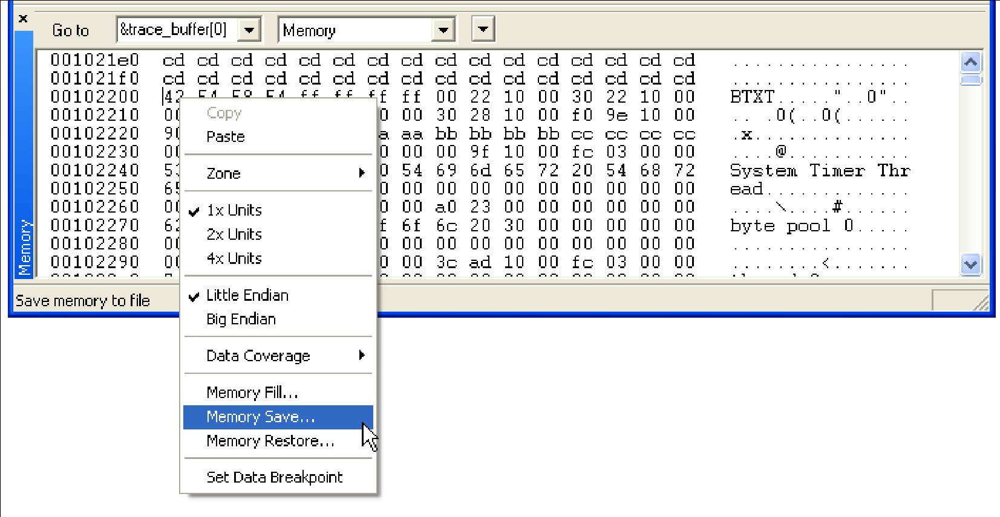
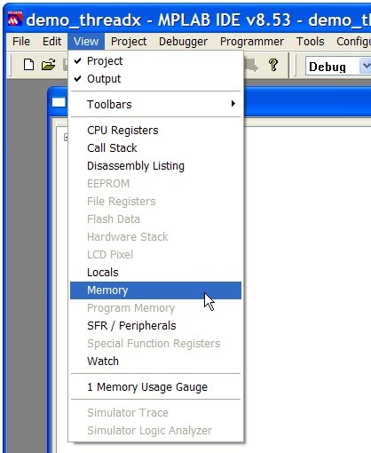
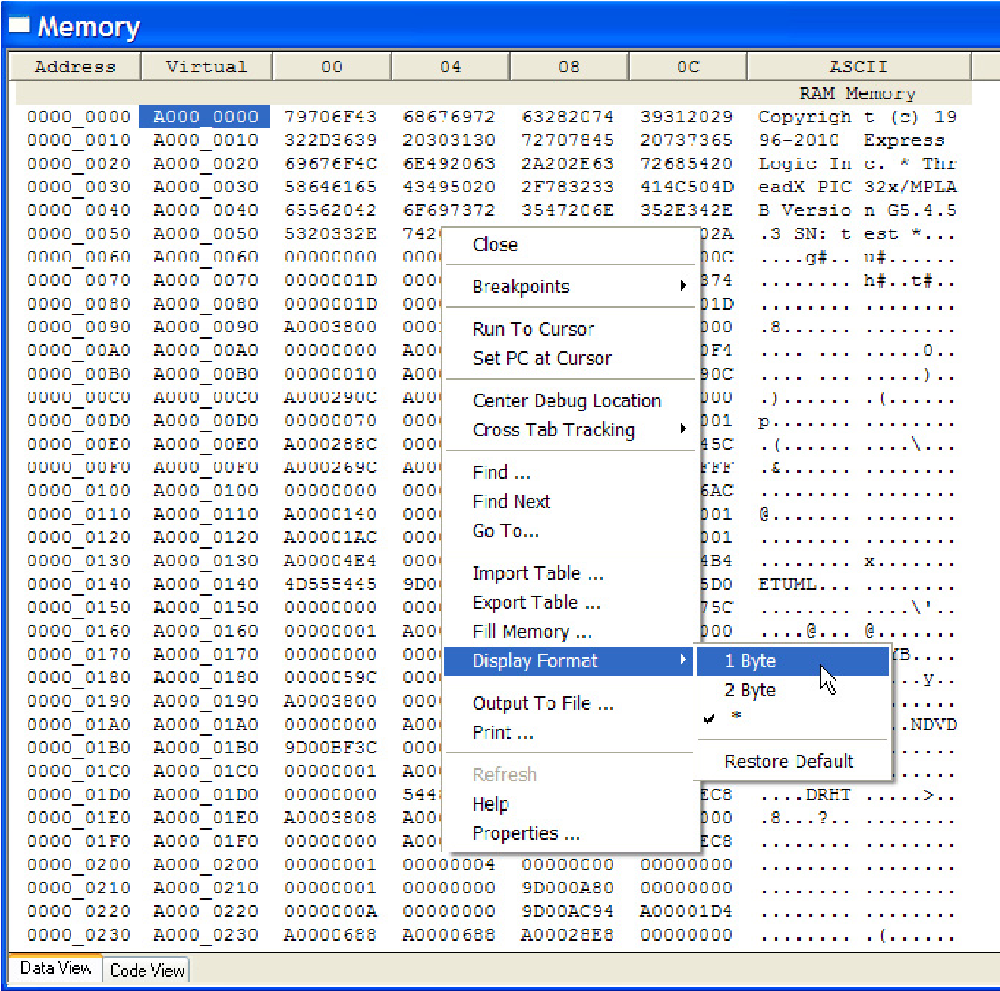
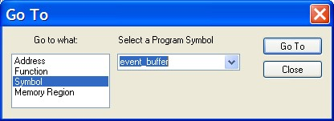
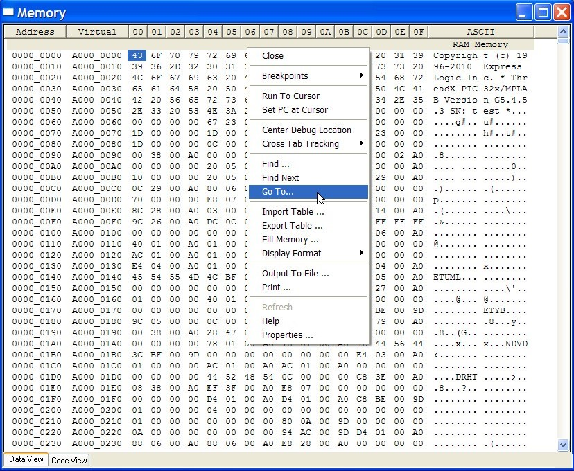
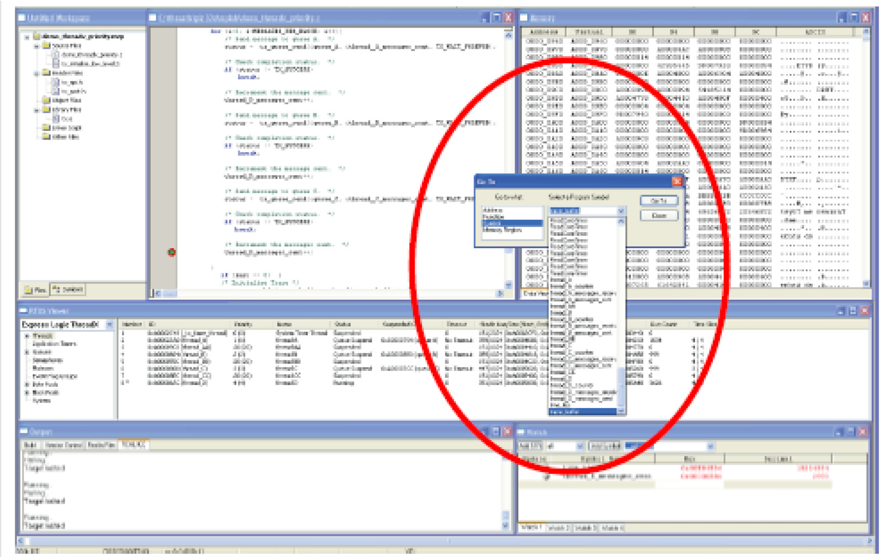
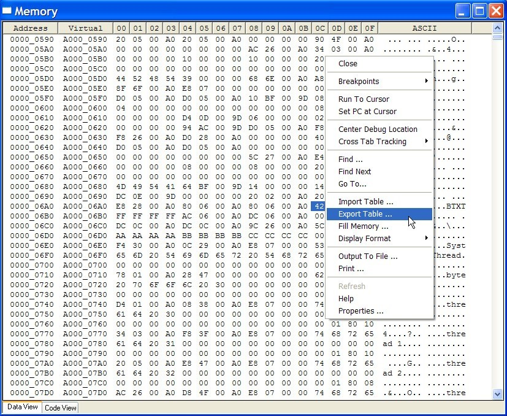
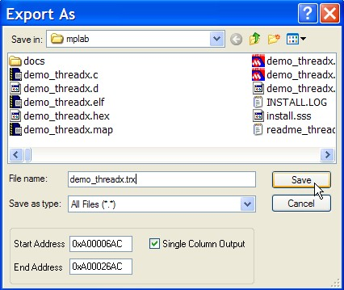
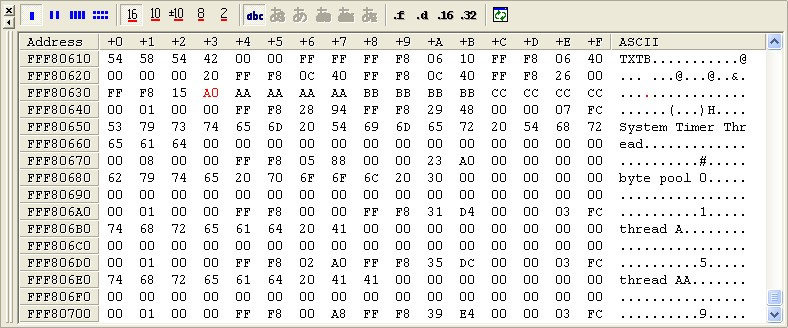
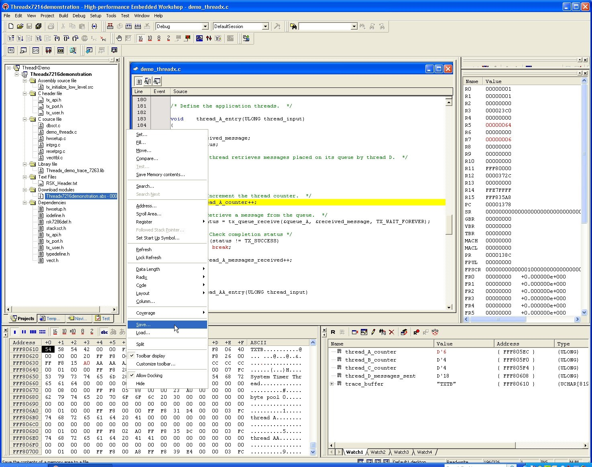

# Appendix D - Dumping and trace buffer

Dumping the trace buffer created by ThreadX to a file on the host computer is done via commands and/or utilities provided by the specific development tool being used. This appendix contains examples of dumping a trace buffer to a host file in some of the more popular development tools used with ThreadX. 

## BenchX Tools

The trace buffer can be dumped to a host file easily with the BenchX tools by selecting the ***Store Memory To File*** button within the ***Memory View***, as shown below:


At this point, specify the trace buffer address, size, destination file name (including path), and select the ***Save*** button as shown below. This will create the binary trace file for viewing within TraceX.


## RealView Tools

The trace buffer can be dumped to a host file easily with the ARM RealView tools by entering the following command at the command-line prompt in RealView:

```c 
> WRITEFILE,raw trace_file.trx=0x6860..0xE560
```

Upon completion, the file ***trace_file.trx*** will contain the trace buffer that is located starting at the address 0x6860 and goes up to address 0xE560. This file is ready for viewing by TraceX.

## IAR Tools

The trace buffer can be dumped to a host file easily with the IAR tools by simply right-clicking in the memory view and selecting the ***Memory Save…*** option, as shown below.



This results in the ***Memory Save*** dialog to be displayed. Enter the starting and ending address and the trace file name, then select the ***Save*** button. In the example shown below, the IAR tools save the specified trace buffer into Intel HEX records in the file ***trace_file.hex***.


At this point, we have the trace buffer saved in the ***trace_file.hex*** file on the host and is ready for viewing with
TraceX.

## CodeWarrior Tools

The trace buffer can be dumped to a host file easily with the CodeWarrior tools by entering the ***save*** command in the Command Window. The following example ***save*** command assumes the trace buffer starts at 0x102200 and ends at 0x109F00:

```c
> save –b p:0x102200..0x109F00 trace_file.trx -a 32bit
```

This results in the trace buffer being saved in the file
***trace_file.trx*** on the host.

## MPLAB Tools

MPLAB can create a TraceX-compatible trace file through its Export Table utility, which allows the export of any range of memory to a host file. To use this utility to create a trace file for TraceX, proceed as follows:

**Step 1** Open a memory window by selecting View -> Memory.



**Step 2** Right-click within the **Memory View** to display a list of options. Specify **Display Format -1 Byte** to select byte display..





**Step 3** Right-click again within the **Memory View** Window and select **Go To**, which opens a dialog box that enables you to specify the address of the event buffer. This example shows ***event_buffer*** being displayed.





**Step 4** This highlights the contents of the first location of the trace buffer, which is always the string BTXT….


**Step 5** Now, right-click again to bring up the options menu, and select **Export Table**.



**Step 6** This brings up the **Export Table** dialog, as shown. Specify the range of addresses to export. For an 8K trace buffer, as is the case in this example, specify the range 0xA00006AC to 0xA00026AC, and enter a name for the host file to be created (demo_threadx.trx in this example).



**Step 7** A file named **demo_threadx.trx** will be created on the host, and this file can be opened by TraceX.

## GHS Tools

The trace buffer can be dumped to a host file easily with the GHS tools by entering the following command at the command-line prompt in the debug command window:

```c
memdump raw c:releasethreadxdemo_threadx.trx event_buffer 32768
```

Upon completion, the file **demo_threadx.trx** will contain the trace buffer that is located in the event_buffer with a size of 32,768 bytes and is ready for viewing by TraceX.

## Renesas HEW

The trace buffer can be dumped to a host file easily with the Renasas HEW tools by following the
three steps (and substeps) below:

**Step 1** Open Memory Window.



**Step 2** Place cursor within memory window and right click.



**Step 3** Select Save, then in the Save Memory As window do the following:

- Select File format: Binary.
- Specify Filename: As Desired
- Specify Start address: trace_buffer
- Specify End address: (trace_buffer+size)
- Specify Access size: 1
- Click Save

