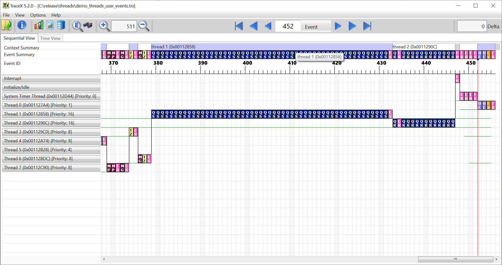
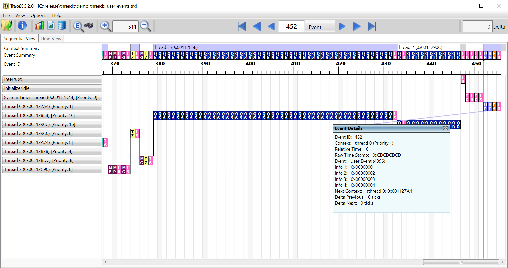
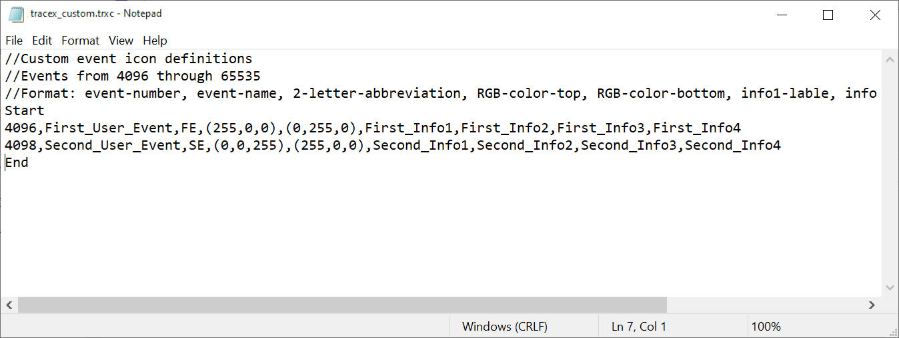
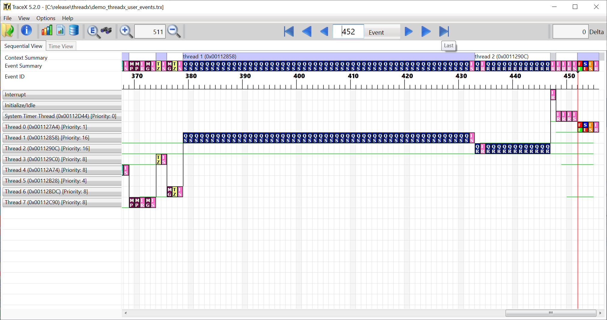
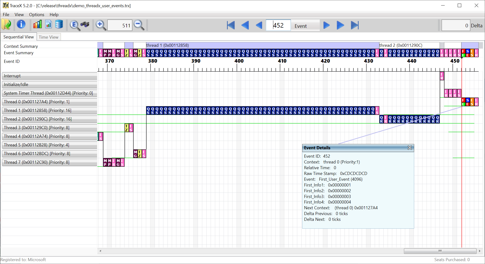

# Chapter 10 - Customer user events

This chapter contains a description of how to create user-defined events and custom icons and information fields for such events. This chapter includes the following sections: 

## Inserting User-Defined Events

ThreadX provides the ability for developers to log their own user-defined events, providing even more useful information that can be viewed graphically by TraceX. User-defined event numbers range from

**TX_TRACE_USER_EVENT_START** (4096) through **TX_TRACE_USER_EVENT_END** (65535), inclusive. The placement of
the events in the trace buffer is done via the ***tx_trace_user_event_insert***, defined in Chapter 5. The
following example calls insert two user-defined events into the current trace buffer on the target, namely user-defined event 4096 and event 4098:

```c
tx_trace_user_event_insert(4096, 1, 2, 3, 4);
tx_trace_user_event_insert(4098,0x100,0x200,0x300,0x400);
```

## Default Display of User-Defined Events


By default, TraceX displays all user events with a default user-defined Event icon as described in Chapter 6. Figure 28 shows the default user-defined event icon for events 452 and 453, which were placed in the event buffer via the previous
***tx_trace_user_event_insert*** examples.


**FIGURE 28**

Detailed information is also available for user-defined Events. Figure 28 shows the detailed event information for event 452, which has event number 4096 and shows the specified four information fields.


**FIGURE 29**

## Defining Custom User-Defined Event Icons

TraceX also provides the user the ability to create custom user-defined event icons and custom information field labels. This capability is achieved by adding event icon specifications to the ***tracex_custom.trxc*** configuration file. This file is located in the ***CustomEvents*** subdirectory of your user-defined TraceX installation directory. An example directory path is shown in Figure 30.


**FIGURE 30**

The ***tracex_custom.trxc*** custom event configuration file is a simple ASCII text file containing zero or more custom event definitions. The format of the file is as follows:

```c
//Comments
**Start **
[custom event definition(s)] **End **
```

Each line between Start and End is used to define a single custom event. TraceX provides a template version of this file with no custom events defined (nothing between the "Start" and "End" labels). The
format of a custom event definition is as follows:

**number, name, abbreviation, top_color, bottom_color, label1, label2, label2, label4**

where:

- number: Defines the user-defined event number, between 4096 and 65535, inclusive.</th>
- name: Defines the logical name for the user-defined event.</td>
- abbreviation: Defines the two-letter user-defined event abbreviation.</td>
- top_color: Defines the RGB value for the top-half of the icon, which is a three-digit number in parenthesis. Some typical 
  RGB definitions are
  - BLACK = (0,0,0)       
  - WHITE = (255,255,255)
  - RED = (255,0,0)     
  - GREEN = (0,255,0)     
  - BLUE = (0,0,255)     
  - YELLOW = (255,255,0)   
  - CYAN = (0,255,255)   
  - MAGENTA = (255,0,255)   
  Using the RBG specification gives the user a broad range of colors for each user-defined icon. For more information on RBG color definition, see: https://en.wikipedia.org/wiki/RGB#Digital_representations
- bottom_color: Defines the RGB value for the bottom half of the icon, which is a three-digit number in parenthesis.
- label1: Label for ***info_field_1***, as specified in the ***tx_trace_user_event_insert*** call.
- label2: Label for ***info_field_2***, as specified in the ***tx_trace_user_event_insert*** call.
- label3: Label for ***info_field_3***, as specified in the ***tx_trace_user_event_insert*** call.
- label4: Label for ***info_field_4***, as specified in the ***tx_trace_user_event_insert*** call.

Example definitions for each of the two user-defined events used in this chapter are shown in Figure 10.4. The first definition is for event 4096 at line 5 of the ***tracex_custom.trxc*** file. This definition gives user-defined event 4096 the name **First_User_Event**, specifies a two-letter abbreviation of **FE**, makes the top portion of the icon red, the bottom portion of the icon green, and names the information fields as **First_Info1**, **First_Info2**, **First_Info3**, and **First_Info4**. User-defined event 4098 is defined similarly at line 6 of ***tracex_custom.trxc***.


**FIGURE 31**

Since the ***tracex_custom.trxc*** file is read by TraceX during initialization, TraceX must be exited and restarted before the custom icon definitions can take effect. Figure 32 shows the TraceX display of user-defined events 452 and 453 with the custom event icons defined in ***tracex_custom.trxc***.


**FIGURE 32**

The additional information in the custom event definition is shown when the event you select using a double-click, mouse-over, or clicking the current event button. Figure 33 shows the double-click selection on event 452. The event name and information fields all match the sample definition that was added to ***tracex_custom.trxc***.


**FIGURE 33**
