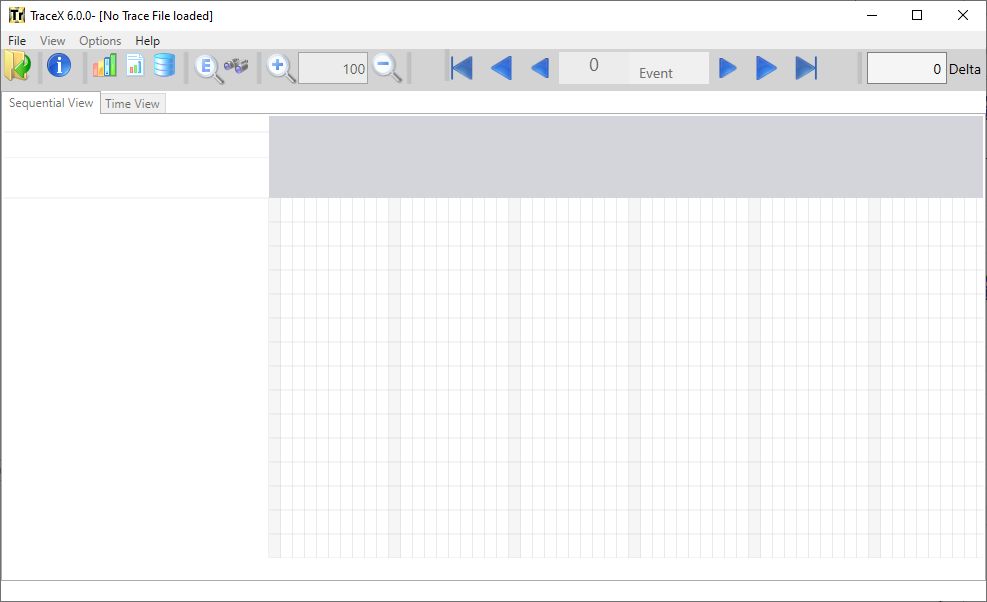
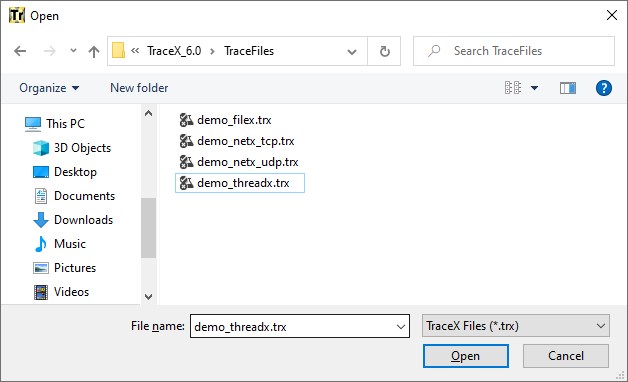

# Chapter 2 - Installation and use of TraceX

This chapter contains a description of various issues related to installation, setup, and usage of the TraceX system analysis tool. 

## Product Distribution

You can obtain the TraceX app from the [Microsoft App Store](https://microsoft.com/store/apps) by searching for TraceX. Then do the following.

1. From the TraceX page in the App Store, click the **Get** or **Install** button to install TraceX.

1. Your browser may display a message asking if you want to open the App Store. If it does, choose the **Open** button.

1. When the install finishes, choose the **Launch** button. 

## Using TraceX

Using TraceX is as easy as opening a trace file inside TraceX! Run TraceX via the ***Start*** button. At this point you will observe the TraceX graphic user interface (GUI). You are now ready to use TraceX to graphically view an existing target trace buffer. This is easily done by clicking ***File -> Open,*** then entering the binary trace file.

> **Important:** *You can also double-click on any trace file with an extension of **trx,** which will automatically launch TraceX.*

**FIGURE 1**

> **Important:** *Refer to **Chapter 5** for instructions on how to generate trace buffers on the target using ThreadX.*

## TraceX Examples

The first time you run the TraceX application, or when the TraceX application is updated, you will be prompted to install the TraceX example trace files and the custom_events.trxc file to a user-defined directory on your local machine.

After this installation step in completed, the example trace files with the extension **trx** are found in the **TraceFiles** subdirectory of your installation folder. These pre-built examples will help you get comfortable with using TraceX on the trace buffers generated by ThreadX running with your application.

One example trace file always present is the file ***demo_threadx.trx***. This example trace file shows the execution of the standard ThreadX demo, as described in Chapter 6 of the *ThreadX User Guide*.

**FIGURE 2**
